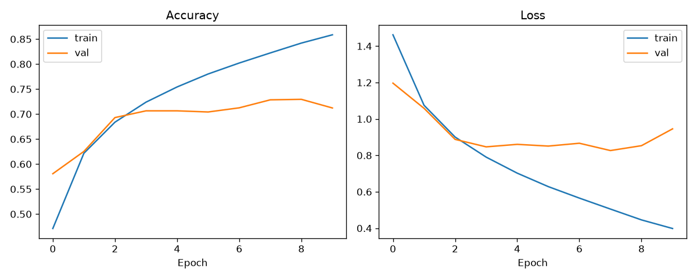
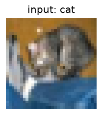
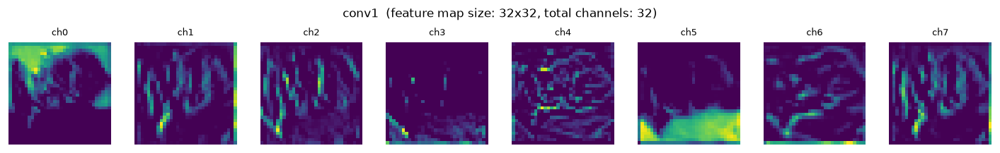
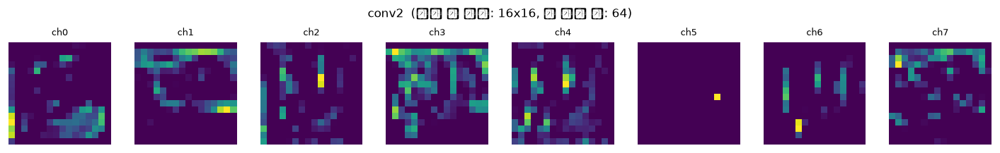
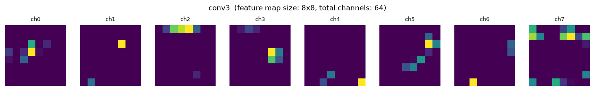
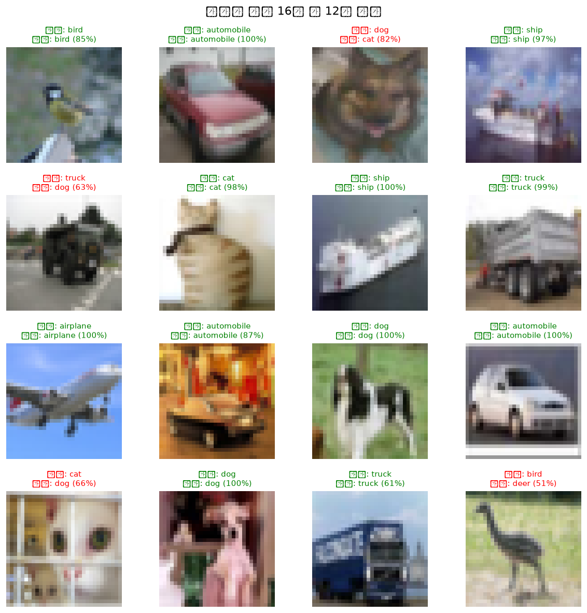
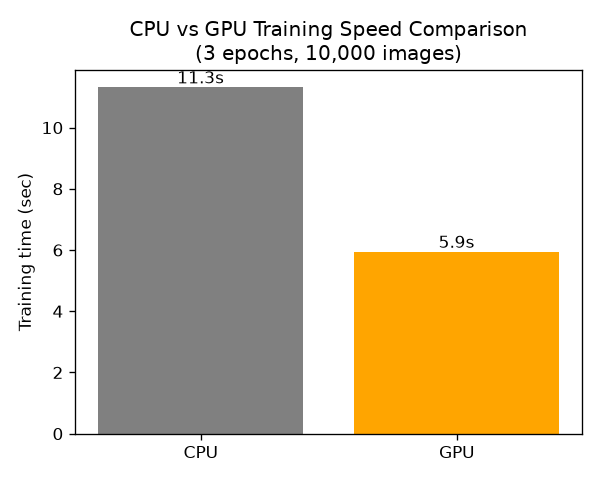

# CNN 딥러닝 실습 (TensorFlow / CIFAR-10)

딥러닝을 처음 접하는 학생을 위한 실습 예제입니다.
간단한 CNN 모델로 이미지를 10개 클래스 중 하나로 "검출(분류)"하는 과정을
직접 실행하면서 눈으로 확인합니다.

## 준비물

- Ubuntu-24.04
- Python 3.9 이상
- 인터넷 연결 (첫 실행 시 CIFAR-10 데이터셋 자동 다운로드, 약 170MB)
- GPU는 없어도 됩니다. GPU/CPU 속도를 비교하고 싶다면 4단계는
  **Google Colab**(무료 GPU 제공) 사용을 추천합니다.

## 설치
- WSL에서 실행시
```bash
sudo apt update && sudo apt upgrade -y
python3 --version   # WSL Ubuntu는 보통 python3.10~3.12 기본 포함
sudo apt install python3-pip python3-venv -y
```
- 프로젝트용 가상환경 생성(프로젝트 폴더에서 수행)
```bash
cd ~
mkdir -p projects && cd projects
sudo python3 -m venv tf_env
source tf_env/bin/activate
```
- 패키지 설치
  - WSL에서 사용시 아래 명령어 수행
```bash
#NVIDIA Container Toolkit 저장소 추가
curl -fsSL https://nvidia.github.io/libnvidia-container/gpgkey | \
sudo gpg --dearmor -o /usr/share/keyrings/nvidia-container-toolkit-keyring.gpg

curl -s -L https://nvidia.github.io/libnvidia-container/stable/deb/nvidia-container-toolkit.list | \
sed 's#deb https://#deb [signed-by=/usr/share/keyrings/nvidia-container-toolkit-keyring.gpg] https://#g' | \
sudo tee /etc/apt/sources.list.d/nvidia-container-toolkit.list

sudo apt update

sudp apt install -y nvidia-container-toolkit

#docker 내 cuda 잡히는지 확인
sudo docker run --gpus all --rm nvcr.io/nvidia/tensorflow:25.02-tf2-py3

#docker 실행
sudo docker run --gpus all --rm -it -p 8888:8888 -v "$PWD":/workspace -w /workspace nvcr.io/nvidia/tensorflow:25.02-tf2-py3 bash

#docker 실행 후
pip install matplotlib

#docker 종료 및 재접속시 데이터 유실 방지 방법
#exit 후 아래 명령어
sudo docker start my_tf_workspace
sudo docker exec -it my_tf_workspace bash
```
  - Ubuntu native 환경에서는 하기 명령어 실행
```bash
pip install --upgrade pip
pip install -r requirements.txt
pip install tensorflow[and-cuda]
```
  - pip 명령어 오류 발생할 경우(WSL 환경에서 permissions 오류시
```bash
sudo chown -R $USER:$USER /path/to/your/venv
```
- GPU 인식 확인
```bash
nvidia-smi   #GPU 정보가 나오면 GPU를 인식하고 있는 것임
```
## 실행 순서

### 1단계 — 모델 학습
```bash
python 01_train.py
```
- CIFAR-10 데이터셋을 다운로드하고 CNN 모델을 10 epoch 학습합니다.
- 결과물:
  - `outputs/model/cnn_cifar10.keras` (학습된 모델, 2/3단계에서 사용)
  - `outputs/training_curve.png` (정확도/손실 그래프)
- CPU만 있는 노트북 기준 약 5~15분 정도 걸릴 수 있습니다.
  (느리다면 `01_train.py`의 `EPOCHS` 값을 줄여도 됩니다)


### 2단계 — 레이어별 액티베이션 맵 시각화
```bash
python 02_visualize_activations.py
```
- 학습된 모델에 이미지 한 장을 입력했을 때, `conv1 -> conv2 -> conv3`
  각 레이어가 뽑아내는 특징 맵(feature map)을 이미지로 저장합니다.
- 결과물: `outputs/activations/` 폴더 안에
  - `00_input.png` (원본 입력 이미지)
  - `conv1.png`, `conv2.png`, `conv3.png` (레이어별 특징 맵 8채널)
- **관찰 포인트**: 레이어가 깊어질수록 특징 맵의 가로/세로 크기는 작아지고,
  표현하는 특징은 선/경계 → 무늬/질감 → 사물의 부분처럼 점점 추상적으로 바뀝니다.
  





### 3단계 — 테스트 예측 결과 시각화
```bash
python 03_test_predictions.py
```
- 테스트셋에서 무작위로 16장을 뽑아 모델이 실제로 어떻게 분류(검출)하는지
  이미지와 함께 보여줍니다. 정답은 초록색, 오답은 빨간색 제목으로 표시됩니다.
- 결과물: `outputs/test_predictions.png`
- 전체 테스트셋(10,000장) 기준 정확도도 콘솔에 출력됩니다.



### 4단계 — CPU vs GPU 학습 속도 비교
```bash
python 04_benchmark_cpu_gpu.py
```
- 동일한 모델을 CPU와 GPU에서 각각 3 epoch씩 학습해 걸린 시간을 비교합니다.
- GPU가 없는 환경에서는 CPU 결과만 출력됩니다.
- 결과물: `outputs/cpu_gpu_benchmark.png` (막대 그래프)
- **Google Colab에서 GPU로 비교해보는 방법**:
  1. https://colab.research.google.com 접속 후 새 노트북 생성
  2. 상단 메뉴 [런타임] → [런타임 유형 변경] → 하드웨어 가속기를 **GPU**로 설정
  3. 이 폴더의 파일들을 업로드하고 `04_benchmark_cpu_gpu.py` 실행
  4. 같은 코드를 하드웨어 가속기 **None(CPU)** 설정으로 다시 실행해서 두 결과를 비교


## 전체 구조 요약

```
cnn_tutorial/
├── 01_train.py                 # 모델 정의 + 학습
├── 02_visualize_activations.py # 레이어별 액티베이션 맵 시각화
├── 03_test_predictions.py      # 테스트 예측 결과 시각화
├── 04_benchmark_cpu_gpu.py     # CPU vs GPU 속도 비교
├── requirements.txt
└── outputs/                    # 실행 후 생성되는 결과물 폴더
```

## 모델 구조

```
Input (32x32x3)
  → Conv2D(32) → MaxPool
  → Conv2D(64) → MaxPool
  → Conv2D(64)
  → Flatten → Dense(64) → Dense(10, softmax)
```

Conv 레이어는 이미지에서 선, 무늬, 사물의 일부 같은 특징을 점점 추상적으로
뽑아내고, 마지막 Dense(10) 레이어가 그 특징들을 종합해서 10개 클래스
(airplane, automobile, bird, cat, deer, dog, frog, horse, ship, truck) 중
하나로 "검출"합니다.
